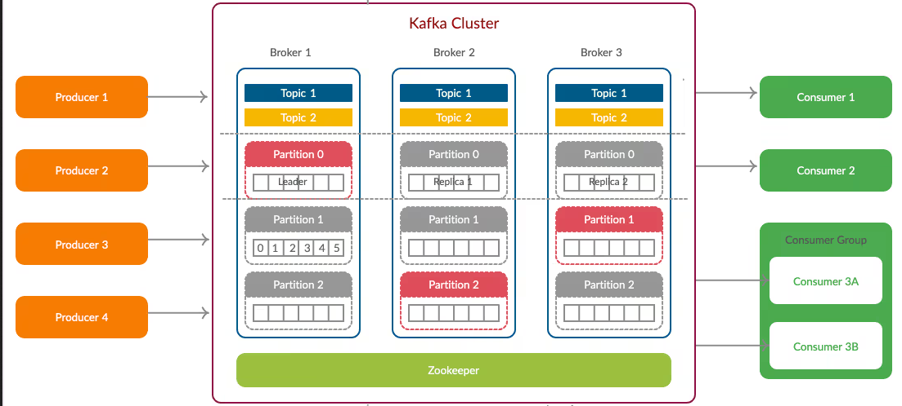
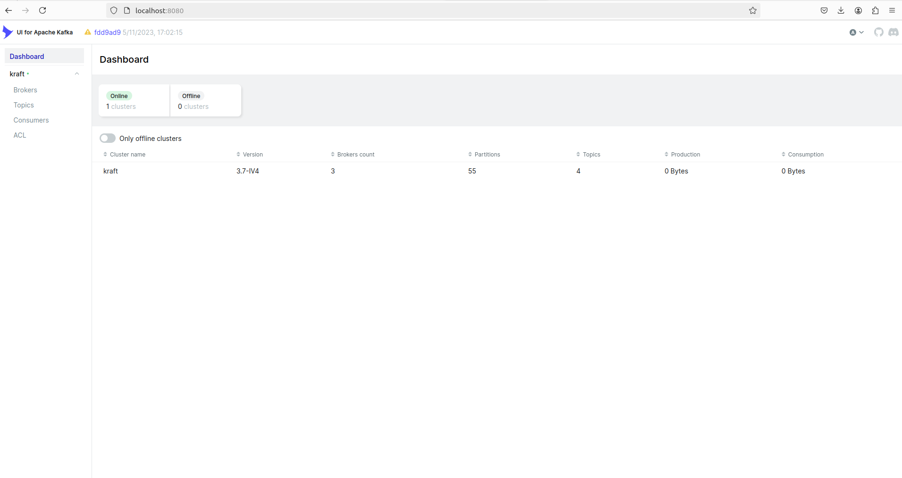
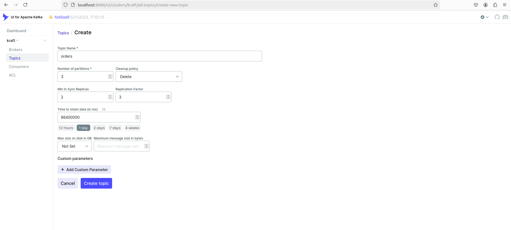
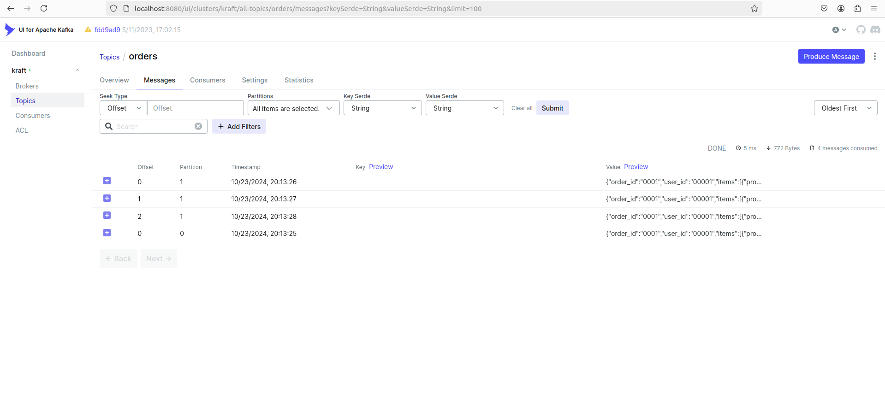
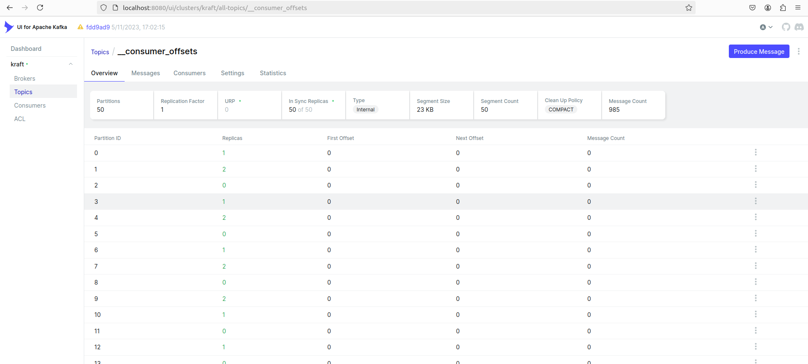

# Введение в Apache Kafka. 

Брокеры сообщений, играют важную роль в архитектуре современных распределенных систем. 
Они обеспечивают асинхронную передачу данных между различными компонентами системы, что позволяет 
улучшить масштабируемость, надежность и производительность, а также позволяют реализовать [kappa-архитектуру](https://bigdataschool.ru/blog/kappa-architecture.html)
и делают связность между сервисами более слабой.

Предположим, у нас есть интернет-магазин с несколькими компонентами:

  1. Веб-сервер: Обрабатывает запросы пользователей.
  2. Система управления заказами: Обрабатывает заказы и управляет их состоянием.
  3. Система управления запасами: Отслеживает наличие товаров на складе.
  4. Cистема уведомлений: Отправляет уведомления пользователям (например, по электронной почте или SMS).

Рассмотрим сценарий обработки заказа. Когда пользователь завершает покупку, веб-сервер получает запрос на создание заказа. Вместо того чтобы сразу его обрабатать, веб-сервер отправляет сообщение о новом заказе в брокер сообщений.

Приведем пример, как могло бы выглядить такое сообщения: 
```json
  {
      "orderId": "12345",
      "userId": "67890",
      "items": [
          {"productId": "535", "quantity": 1, "price": 300},
          {"productId": "125", "quantity": 2, "price": 100}
      ],
      "totalPrice": 400.00
  }
```

Система управления заказами подписана на сообщения о новых заказах. Она получает сообщение, обрабатывает его 
(например, проверяет наличие товаров, создает запись в базе данных) и обновляет статус заказа. 
После успешной обработки заказа система управления заказами отправляет сообщение в брокер о том, что товары были заказаны. 
Система управления запасами подписана на эти сообщения и обновляет количество доступных товаров на складе. 
После того как заказ был успешно обработан, система управления заказами отправляет сообщение о завершении заказа в брокер.
Система уведомлений подписана на эти сообщения и отправляет пользователю уведомление о том, что заказ был успешно оформлен.

## Создание собственного брокера сообщений

Давайте попробуем сделать имитацию такого брокера сообщений с использованием обычного файла для хранения сообщений и поговорим о терминалогии. 


Для начала напишем клиентский код, который отвечает за запись сообщениий в наш импровизируемый "брокер". 
Такой клиентский код называется **Продюсером (Producer)**. Он публикует сообщения в брокер. 


```go
package main

import (
	"encoding/json"
	"log"
	"os"
	"sync"
)

// Item - структура описывающая продукт в заказе
type Item struct {
	ProductID string  `json:"product_id"`
	Quantity  int     `json:"quantity"`
	Price     float64 `json:"price"`
}

// Order - структура описывающая заказ с продуктами
type Order struct {
	OrderID    string  `json:"order_id"`
	UserID     string  `json:"user_id"`
	Items      []Item  `json:"items"`
	TotalPrice float64 `json:"total_price"`
}

func main() {
	var wg sync.WaitGroup
  // Фиктивные заказы, которые будем отправлять в брокер
	orders := []*Order{
		{
			OrderID: "0001",
			UserID:  "00001",
			Items: []Item{
				{ProductID: "535", Quantity: 1, Price: 300},
				{ProductID: "125", Quantity: 2, Price: 100},
			},
			TotalPrice: 500.00,
		},
		{
			OrderID: "0002",
			UserID:  "00002",
			Items: []Item{
				{ProductID: "035", Quantity: 7, Price: 100},
				{ProductID: "525", Quantity: 1, Price: 500},
			},
			TotalPrice: 1200.00,
		},
		{
			OrderID: "0003",
			UserID:  "00003",
			Items: []Item{
				{ProductID: "035", Quantity: 10, Price: 100},
				{ProductID: "525", Quantity: 2, Price: 500},
			},
			TotalPrice: 2000.00,
		},
	}

	wg.Add(1)
	// запустим продюсер в горутине
	go produce(orders, &wg)
	wg.Wait()

}

// produce - имитриуем продьюсера
func produce(orders []*Order, wg *sync.WaitGroup) {
	defer wg.Done()

	for _, order := range orders {
		// Открываем файл в режиме добавления
		file, err := os.OpenFile("orders.json", os.O_APPEND|os.O_CREATE|os.O_WRONLY, 0644)
		if err != nil {
			log.Fatalln("Ошибка при открытии файла:", err)
		}
		defer file.Close()

		// Сериализуем объект заказа в JSON
		orderJSON, err := json.Marshal(order)
		if err != nil {
			log.Fatalln("Ошибка при сериализации в JSON:", err)
		}

		// Добавляем новую строку для удобства чтения
		orderJSON = append(orderJSON, '\n')

		// Записываем JSON в файл
		if _, err := file.Write(orderJSON); err != nil {
			log.Fatalln("Ошибка при записи в файл:", err)
		}
		log.Printf("Заказ c ID %s успешно записан в файл.", order.OrderID)
	}
}

```

Запустите код, будет создан файл  с именем `orders.json`, в который будут записаны данные: 

```json
{"order_id":"0001","user_id":"00001","items":[{"product_id":"535","quantity":1,"price":300},{"product_id":"125","quantity":2,"price":100}],"total_price":500}
{"order_id":"0002","user_id":"00002","items":[{"product_id":"035","quantity":7,"price":100},{"product_id":"525","quantity":1,"price":500}],"total_price":1200}
{"order_id":"0003","user_id":"00003","items":[{"product_id":"035","quantity":10,"price":100},{"product_id":"525","quantity":2,"price":500}],"total_price":2000}

```
В терминале должно появиться: 

```
2024/10/21 11:54:32 Заказ c ID 0001 успешно записан в файл.
2024/10/21 11:54:32 Заказ c ID 0002 успешно записан в файл.
2024/10/21 11:54:32 Заказ c ID 0003 успешно записан в файл.
```

Теперь перейдем к клиентскому приложению, которое отвечает за чтение сообщениий. Такой клиентский код называется **Консьюмером (Consumer)**. Он читает сообщения из брокера.

```go
package main

import (
	"encoding/json"
	"log"
	"os"
	"sync"
)

// Item - структура описывающая продукт в заказе
type Item struct {
	ProductID string  `json:"product_id"`
	Quantity  int     `json:"quantity"`
	Price     float64 `json:"price"`
}

// Order - структура описывающая заказ с продуктами
type Order struct {
	Offset     int     `json:"offset"`
	OrderID    string  `json:"order_id"`
	UserID     string  `json:"user_id"`
	Items      []Item  `json:"items"`
	TotalPrice float64 `json:"total_price"`
}

func main() {
	var wg sync.WaitGroup

	wg.Add(1)
	// запустим консьюмер в горутине
	go consume(&wg)
	wg.Wait()

}

func consume(wg *sync.WaitGroup) {
	defer wg.Done()

	// Открываем файл для чтения
	file, err := os.OpenFile("orders.json", os.O_CREATE|os.O_RDONLY, 0644)
	if err != nil {
		log.Fatalln("Ошибка при открытии файла:", err)
	}
	defer file.Close()

	// Читаем файл построчно
	var order Order
	decoder := json.NewDecoder(file)
	for {
		if err := decoder.Decode(&order); err != nil {
			if err.Error() == "EOF" {
				break // Достигнут конец файла
			}
			log.Fatalln("Ошибка при декодировании JSON:", err)
		}
		log.Printf("Прочитанный заказ: %+v\n", order)
	}
}

```
В терминале появятся заказы:
```
2024/10/21 11:52:13 Прочитанный заказ: {Offset:0 OrderID:0001 UserID:00001 Items:[{ProductID:535 Quantity:1 Price:300} {ProductID:125 Quantity:2 Price:100}] TotalPrice:500}
2024/10/21 11:52:13 Прочитанный заказ: {Offset:0 OrderID:0002 UserID:00002 Items:[{ProductID:035 Quantity:7 Price:100} {ProductID:525 Quantity:1 Price:500}] TotalPrice:1200}
2024/10/21 11:52:13 Прочитанный заказ: {Offset:0 OrderID:0003 UserID:00003 Items:[{ProductID:035 Quantity:10 Price:100} {ProductID:525 Quantity:2 Price:500}] TotalPrice:2000}
```

___
### Задание. 
Доработайте код: объедените код продьюсера и консьюмера. Сделайте, чтобы продьюсер и консьюмер
могли работать параллельно. А если консьюмер вдруг по какой-то причине будет выключен, необходимо,
чтобы он начал читать с того самого места - **Смещения (Offset)**, на котором он остановился.
Для хранения *смещения* используйте файл.

<br>
<details> 
<summary>Подсказка: работа со смещением консьюмера  (нажмите, чтобы увидеть код)</summary>
	Используйте файл для хранения смещения
	
```go
	offsetFile, err := os.OpenFile("offset.txt", os.O_CREATE|os.O_RDWR, 0644)
```

 Для получения смещения и его применения можно использовать функцию [Seek](https://gobyexample.com.ru/reading-files)
```go
	offset, err = file.Seek(0, io.SeekCurrent)
```

</details> 

<br>
<details> 
<summary>Ознакомиться с решением (нажмите, чтобы увидеть код)</summary>

```go
package main

import (
	"encoding/json"
	"fmt"
	"io"
	"log"
	"os"
	"sync"
	"time"

	"golang.org/x/exp/rand"
)

// Количество заказов для генерции
const productNum = 3

// Item - структура описывающая продукт в заказе
type Item struct {
	ProductID string  `json:"product_id"`
	Quantity  int     `json:"quantity"`
	Price     float64 `json:"price"`
}

// Order - структура описывающая заказ с продуктами
type Order struct {
	OrderID    string  `json:"order_id"`
	UserID     string  `json:"user_id"`
	Items      []Item  `json:"items"`
	TotalPrice float64 `json:"total_price"`
}

type orderGenerator struct {
	orderId   int
	numOrders int
}

// generateOrders функция генератор заказов
func (og *orderGenerator) generate() []*Order {
	// Инициализация генератора случайных чисел, чтобы были повторяемые результаты
	rand.Seed(0)

	orders := make([]*Order, og.numOrders)
	k := 0
	current_order := og.orderId
	for og.orderId < current_order+og.numOrders {

		// Формируем данные

		orderID := fmt.Sprintf("%04d", og.orderId)
		userID := fmt.Sprintf("%05d", rand.Intn(100000))

		// Генерируем случайное кол-во товаров от 1 до 5
		numItems := rand.Intn(5) + 1
		items := make([]Item, numItems)
		totalPrice := 0.0

		for j := 0; j < numItems; j++ {
			productID := fmt.Sprintf("%03d", rand.Intn(1000))
			quantity := rand.Intn(10) + 1
			price := float64(rand.Intn(1000)) + rand.Float64()

			items[j] = Item{
				ProductID: productID,
				Quantity:  quantity,
				Price:     price,
			}
			totalPrice += price * float64(quantity) // Суммируем общую стоимость
		}
		orders[k] = &Order{
			OrderID:    orderID,
			UserID:     userID,
			Items:      items,
			TotalPrice: totalPrice,
		}
		k++
		og.orderId++
	}

	return orders
}

func main() {
	var wg sync.WaitGroup
	wg.Add(2)

	var lock sync.Mutex

	// продюсер и консьюмер работают параллельно
	go produce(&wg, &lock)
	go consume(&wg, &lock)

	wg.Wait()

}

// produce - имулирует работу продюсера
func produce(wg *sync.WaitGroup, lock *sync.Mutex) {
	defer wg.Done()
	ordGenerator := orderGenerator{numOrders: productNum}
	for {
		// Получаем слайс случайных заказов

		orders := ordGenerator.generate()

		var jsons []byte

		for _, order := range orders {
			// Сериализуем объект заказа в JSON
			orderJSON, err := json.Marshal(order)
			if err != nil {
				log.Fatalln("Ошибка при сериализации в JSON:", err)
			}

			// Добавляем новую строку для удобства чтения
			orderJSON = append(orderJSON, '\n')
			jsons = append(jsons, orderJSON...)
		}

		// защищаем общие данные и участки кода от одновременного доступа.
		lock.Lock()
		// Открываем файл в режиме добавления
		file, err := os.OpenFile("orders.json", os.O_APPEND|os.O_CREATE|os.O_WRONLY, 0644)
		if err != nil {
			log.Fatalln("Ошибка при открытии файла:", err)
		}

		if _, err := file.Write(jsons); err != nil {
			log.Fatalln("Ошибка при записи в файл:", err)
		}
		log.Println("Заказы успешно записаны в файл.")

		// Закрываем файл и снимаем блокировку.
		file.Close()
		lock.Unlock()
		// Делаем паузу перед следующим добавлением данных
		time.Sleep(2 * time.Second)
	}
}

// consume - имулирует работу консьюмера
func consume(wg *sync.WaitGroup, lock *sync.Mutex) {
	defer wg.Done()

	for {
		// защищаем общие данные и участки кода от одновременного доступа.
		lock.Lock()
		// Открываем файл для чтения
		file, err := os.OpenFile("orders.json", os.O_CREATE|os.O_RDONLY, 0644)
		if err != nil {
			log.Fatalln("Ошибка при открытии файла:", err)
		}

		// Открываем файл для чтения офсета
		offsetFile, err := os.OpenFile("offset.txt", os.O_CREATE|os.O_RDWR, 0644)
		if err != nil {
			log.Fatalln("Ошибка при открытии файла офсета:", err)
		}

		// Читаем офсет из файла
		var offset int64
		if _, err := fmt.Fscanf(offsetFile, "%d", &offset); err != nil && err.Error() != "EOF" {
			log.Fatalln("Ошибка при чтении офсета:", err)
		}

		// Устанавливаем офсет для чтения
		_, err = file.Seek(offset, 0)
		if err != nil {
			log.Fatalln("Ошибка при установке офсета:", err)
		}

		// Читаем файл и обрабатываем его
		var order Order
		decoder := json.NewDecoder(file)
		for {
			if err := decoder.Decode(&order); err != nil {
				if err.Error() == "EOF" {
					break // Достигнут конец файла
				}
				log.Fatalln("Ошибка при декодировании JSON:", err)
			}
			log.Printf("Прочитанный заказ: %+v\n", order)
		}
		// Обновляем офсет
		offset, err = file.Seek(0, io.SeekCurrent)
		if err != nil {
			log.Fatalln("Ошибка при получении текущего офсета:", err)
		}

		// Записываем новый офсет в файл
		offsetFile.Truncate(0) // Очищаем файл
		offsetFile.Seek(0, 0)  // Возвращаемся в начало файла
		if _, err := fmt.Fprintf(offsetFile, "%d", offset); err != nil {
			log.Fatalln("Ошибка при записи офсета:", err)
		}
		// Закрываем файлы и снимаем блокировку.
		file.Close()
		offsetFile.Close()

		lock.Unlock()
		time.Sleep(2 * time.Second)
	}
}

```
</details> 

<br>

_____

<br>

В нашем импровизированном примере с созданием брокера сообщений в одном файле мы столкнулись с ограничениями, связанными с масштабируемостью и устойчивостью системы. Понятно, что брокеры сообщений устроены куда сложнее. Чтобы улучшить архитектуру, нам необходимо рассмотреть возможность распределенного хранения сообщений, что позволит запускать брокер на кластере машин. Это обеспечит высокую доступность и устойчивость к сбоям, так как в случае выхода из строя одной из машин, другие смогут продолжать обработку сообщений. Кроме того, распределенная система позволит значительно увеличить пропускную способность, что критично для современных приложений с высокими требованиями к производительности. В этом контексте стоит обратить внимание на Apache Kafka, который является мощным решением для организации потоковой передачи данных и управления сообщениями в распределенных системах, обеспечивая надежность и масштабируемость.
Тем не менее, пример выше позволяет вам ознакомиться с основными концепциями и принципами работы брокеров сообщений. 

<br>

Давайте повторим базовые понятия:

1. **Продьюсер (Producer)** — это клиентское приложение, которые публикует сообщения в брокер. 
2. **Консьюмер (Consumer)** — это клиентское приложение, которое подписывается на интересующие его сообщения и обрабатывает их.
3. **Смещение (Offset)** — порядковый номер, который указывает на положение сообщения.

## Apache Kafka 

[**Kafka**](https://habr.com/ru/companies/piter/articles/352978/) была разработана в компании LinkedIn в 2011 году и с тех пор претерпела значительные улучшения.
Сегодня Kafka представляет собой полноценную платформу, обеспечивающую возможность хранения огромных объемов данных. Она предлагает шину сообщений с высокой пропускной способностью, позволяя в реальном времени обрабатывать все данные, проходящие через нее.

Однако, если свести **Kafka** к основным характеристикам, то это будет распределенный, реплицируемый, горизонтально масштабируемый и отказоустойчивый лог сообщений.

Давайте разберем каждый из этих терминов и выясним, что они означают.

**Распределенной** называется система, которая работает на множестве машин, образующих кластер, при этом для конечного пользователя она выглядит как единый узел. В Kafka хранение, получение и рассылка сообщений организованы на различных узлах, называемых «брокерами». Основные преимущества такого подхода – высокая доступность и отказоустойчивость.

**Реплицируемый** означает, что все данные синхронизируются между брокерами.

Прежде чем опишем, что такое горизонтально масштабирование, расскажем про вертикальное. Например, у нас есть традиционный сервер базы данных, который постепенно перестает справляться с растущей нагрузкой. Чтобы решить эту проблему, можно увеличить ресурсы (CPU, RAM, SSD) на сервере. Это и есть **вертикальное масштабирование** – добавление ресурсов к одной машине. Однако у этого подхода есть два серьезных недостатка:

1. Существуют физические ограничения, связанные с возможностями оборудования, и бесконечно увеличивать ресурсы невозможно.
2. Процесс масштабирования часто сопровождается простоями, что недопустимо для крупных компаний.

**Горизонтальная масштабируемость** решает ту же проблему, но с помощью подключения дополнительных машин. Однако стоит отметить, что не все системы поддерживают горизонтальную масштабируемость: многие из них не предназначены для работы с кластерами (наш импровизированный "брокер" сообщений, как раз такой), а те, что предназначены, часто оказываются сложными в эксплуатации.

После достижения определенного порога горизонтальное масштабирование становится значительно более экономичным по сравнению с вертикальным.

Нераспределенные системы часто имеют единую точку отказа. Если единственный сервер вашей базы данных выйдет из строя, это приведет к серьезным проблемам. В отличие от этого, распределенные системы проектируются с учетом возможности адаптации к сбоям (обладают **отказоустойчивостью**). Например, кластер Kafka из пяти узлов продолжает функционировать, даже если два узла выходят из строя. Однако стоит отметить, что для обеспечения отказоустойчивости иногда приходится жертвовать производительностью: чем лучше система справляется с отказами, тем ниже ее общая производительность.

**Лог сообщений** представляет собой долговременную упорядоченную структуру данных, в которую можно только добавлять записи. Мы делали также с нашим файлом в продьюсере. 

```go
file, err := os.OpenFile("orders.json", os.O_APPEND|os.O_CREATE|os.O_WRONLY, 0644)
```
Изменять или удалять данные в этом журнале нельзя. Информация считывается слева направо, что обеспечивает правильный порядок элементов.
Такие файлы-журналы объеденяются в **партиции**. А набор партиций составляет **топик**.  Топики в Kafka могут иметь одного или нескольких продьюсеров/консьюмеров, а также могут не иметь их вовсе. 

_____

<br>
<details> 
<summary>Интересный факт (Нажми, чтобы прочитать)</summary>
    Операции чтения и записи в Kafka выполняются за постоянное время O(1) (если известен ID записи), что значительно экономит время по сравнению с операциями O(log N) в других структурах данных, так как каждая операция перемещения головок на диске является затратной. При этом операции чтения и записи не блокируют друг друга. Эти два аспекта значительно увеличивают производительность, так как она не зависит от объема данных. Kafka работает одинаково эффективно, независимо от того, храните ли вы несколько килоБайт данных или сотни терабайт!

</details> 
<br>

_____

Такое распределение данных критически важно для масштабирования, так как оно позволяет клиентским приложениям читать и записывать данные параллельно c разных брокерах. Когда новое сообщение публикуется в топик, оно добавляется в одну из его партиций.
Механизм выбора партиции зависит от продьюсера и настроек. Если при записи сообщения указан ключ, Kafka использует его для определения, в какую партицию будет отправлено сообщение. В этом случае все сообщения с одним и тем же ключом, например, ID заказа (наш order_id), всегда будут добавлены в одну и ту же партицию. Если ключ не указан, сообщения распределяются по всем партициям топика равномерно.
Kafka гарантирует, что любой консьюмер для конкретного топика и партиции будет всегда считывать сообщения в том порядке, в котором они были записаны. Когда новое сообщение публикуется в топик, оно добавляется в одну из его партиций. Kafka выбирает подходящую партицию с помощью ключа партиции, расчитывая хэш. **Ключ партиции** (Partition key) — это опциональный компонент сообщения, который используется для определения, в какую партицию будет отправлено сообщение. Если ключ партиции указан, Kafka гарантирует, что все сообщения с одним и тем же ключом будут направлены в одну и ту же партицию. 

Принцип расчета хэша от ключа зависит от языка разработки. В частности, Java-библиотека для продьюсеров Kafka для вычисления хэш-значения ключа партиционирования использует 32-битный алгоритм хэширования [murmur2](https://ru.wikipedia.org/wiki/MurmurHash2). Это простая и быстрая хеш-функция общего назначения, разработанная Остином Эпплби. Она не является криптографически-безопасной и возвращает 32-разрядное беззнаковое число. Алгоритм murmur2 характеризуется высокой скоростью и устойчивостью к коллизиям. 

Однако, далеко не все разработчики используют Java для создания продюсеров Kafka. Мы, в частонсти, используем язык программирования Go в наших примерах. В раде реализаций библиотек для работы с Kafka на ЯП Python, [Go](https://github.com/confluentinc/confluent-kafka-go) , .NET, C# может использоваться библиотека [librdkafka](https://github.com/confluentinc/librdkafka) (написанная на С). Она предоставляет высокопроизводительную, легкую и многофункциональную реализацию протокола Kafka, позволяя клиентским приложениям взаимодействовать с кластерами Kafka.

librdkafka по умолчанию использует другой алгоритм хэширования — CRC32 — 32-битная циклическая проверка контрольной суммы (Cyclic Redundancy Check). Этот алгоритм представляет собой способ цифровой идентификации некоторой последовательности данных, который заключается в вычислении контрольного значения её циклического избыточного кода. Подробнее [тут](https://www.confluent.io/blog/standardized-hashing-across-java-and-non-java-producers/). Мы попозже еще вернемся к использованию Go библиотеки для передачи данных  между продьюсером и консьюмером, а пока давайте разберемся с инфраструктурой. 

Чтобы наглядно представить, как все эти элементы (брокеры, топики, продьюсеры и консьюмеры)
взаимодействуют между собой, лучше всего воспользоваться рисунком. На нем мы сможем изобразить 
Kafka-брокер как центральный узел, к которому подключены продьюсеры и консьюмеры. 
Топики, как разные каналы передачи данных, будут представлены в виде отдельных линий,
идущих от брокера. Продьюсеры, как источники данных, будут отправлять сообщения в 
конкретные топики. 
Консьюмеры, наоборот, будут подключаться к топикам и получать сообщения от брокера. Такое
визуальное представление сделает концепцию Kafka более интуитивно понятной и поможет уяснить 
ключевые принципы ее работы.


Изображение взято с [сайта](https://estuary.dev/static/7ba0c5c3971f2b18f35438fc94246138/a9ac2/02_Data_Pipeline_Kafka_Kafka_Cluster_2a7192509f.avif)

## Порядок установки и настройки кластера локально с использованием Docker

Одним из самых простых способов запустить Kafka является использование Docker Compose.

1. Установите [Docker](https://docs.docker.com/engine/install/)

2. Создайте файл docker-compose.yml
Создайте новый файл с именем docker-compose.yml в удобном для вас каталоге. В этом файле вы будете описывать конфигурацию для Kafka.

3. Напишите конфигурацию
Вставьте следующий код в ваш [docker-compose.yml](https://habr.com/ru/articles/810061/) файл:

```yaml
version: "3.5"
services:

  x-kafka-common:
    &kafka-common
    image: bitnami/kafka:3.7
    environment:
      &kafka-common-env
      KAFKA_ENABLE_KRAFT: yes
      ALLOW_PLAINTEXT_LISTENER: yes
      KAFKA_KRAFT_CLUSTER_ID: practicum
      KAFKA_CFG_LISTENER_SECURITY_PROTOCOL_MAP: "CONTROLLER:PLAINTEXT,EXTERNAL:PLAINTEXT,PLAINTEXT:PLAINTEXT"
      KAFKA_CFG_PROCESS_ROLES: broker,controller
      KAFKA_CFG_CONTROLLER_LISTENER_NAMES: CONTROLLER
      KAFKA_CFG_CONTROLLER_QUORUM_VOTERS: 0@kafka-0:9093,1@kafka-1:9093,2@kafka-2:9093
      KAFKA_CFG_AUTO_CREATE_TOPICS_ENABLE: false
    networks:
      - proxynet

  kafka-0:
    <<: *kafka-common
    restart: always
    ports:
      - "127.0.0.1:9094:9094"
    environment:
      <<: *kafka-common-env
      KAFKA_CFG_NODE_ID: 0
      KAFKA_CFG_LISTENERS: PLAINTEXT://:9092,CONTROLLER://:9093,EXTERNAL://:9094
      KAFKA_CFG_ADVERTISED_LISTENERS: PLAINTEXT://kafka-0:9092,EXTERNAL://127.0.0.1:9094
    volumes:
      - kafka_0_data:/bitnami/kafka

  kafka-1:
    <<: *kafka-common
    restart: always
    ports:
      - "127.0.0.1:9095:9095"
    environment:
      <<: *kafka-common-env
      KAFKA_CFG_NODE_ID: 1
      KAFKA_CFG_LISTENERS: PLAINTEXT://:9092,CONTROLLER://:9093,EXTERNAL://:9095
      KAFKA_CFG_ADVERTISED_LISTENERS: PLAINTEXT://kafka-1:9092,EXTERNAL://127.0.0.1:9095
    volumes:
      - kafka_1_data:/bitnami/kafka

  kafka-2:
    <<: *kafka-common
    restart: always
    ports:
      - "127.0.0.1:9096:9096"
    environment:
      <<: *kafka-common-env
      KAFKA_CFG_NODE_ID: 2
      KAFKA_CFG_LISTENERS: PLAINTEXT://:9092,CONTROLLER://:9093,EXTERNAL://:9096
      KAFKA_CFG_ADVERTISED_LISTENERS: PLAINTEXT://kafka-2:9092,EXTERNAL://127.0.0.1:9096
    volumes:
      - kafka_2_data:/bitnami/kafka

  schema-registry:
    image: bitnami/schema-registry:7.6
    ports:
      - '8081:8081'
    depends_on:
      - kafka-0
      - kafka-1
      - kafka-2
    environment:
      SCHEMA_REGISTRY_LISTENERS: http://0.0.0.0:8081
      SCHEMA_REGISTRY_KAFKA_BROKERS: PLAINTEXT://kafka-0:9092,PLAINTEXT://kafka-1:9092,PLAINTEXT://kafka-2:9092
    networks:
      - proxynet
   
  ui:
    image: provectuslabs/kafka-ui:v0.7.0
    restart: always
    ports:
      - "127.0.0.1:8080:8080"
    environment:
      KAFKA_CLUSTERS_0_BOOTSTRAP_SERVERS: kafka-0:9092
      KAFKA_CLUSTERS_0_NAME: kraft
    networks:
      - proxynet

networks:
  proxynet:
    name: custom_network

volumes:
  kafka_0_data:
  kafka_1_data:
  kafka_2_data:
```

4. В терминале перейдите в каталог, где находится ваш docker-compose.yml файл, и выполните команду:

```bash
docker compose up -d
```

5. Для проверки успешности запуска введите в терминале:

```bash
docker ps -a 
```

Ожидаемый вывод в терминале
```bash
CONTAINER ID   IMAGE                           COMMAND                  CREATED          STATUS          PORTS                                       NAMES
d39848462767   bitnami/schema-registry:7.6     "/opt/bitnami/script…"   21 seconds ago   Up 18 seconds   0.0.0.0:8081->8081/tcp, :::8081->8081/tcp   infra-schema-registry-1
e8efd3eb23d8   provectuslabs/kafka-ui:v0.7.0   "/bin/sh -c 'java --…"   21 seconds ago   Up 19 seconds   127.0.0.1:8080->8080/tcp                    infra-ui-1
435e5dc83747   bitnami/kafka:3.7               "/opt/bitnami/script…"   21 seconds ago   Up 19 seconds   9092/tcp, 127.0.0.1:9096->9096/tcp          infra-kafka-2-1
c249a9c01c72   bitnami/kafka:3.7               "/opt/bitnami/script…"   21 seconds ago   Up 20 seconds   9092/tcp, 127.0.0.1:9094->9094/tcp          infra-kafka-0-1
a65bf04f14b8   bitnami/kafka:3.7               "/opt/bitnami/script…"   21 seconds ago   Up 19 seconds   9092/tcp, 127.0.0.1:9095->9095/tcp          infra-kafka-1-1
```


Познакомимся подробнее с `docker-compose.yaml` файлом. Рассмотрим, фрагмент:

```yaml
x-kafka-common:
    &kafka-common
    image: bitnami/kafka:3.7
    environment:
      &kafka-common-env
      KAFKA_ENABLE_KRAFT: yes
      ALLOW_PLAINTEXT_LISTENER: yes
      KAFKA_KRAFT_CLUSTER_ID: practicum
      KAFKA_CFG_LISTENER_SECURITY_PROTOCOL_MAP: "CONTROLLER:PLAINTEXT,EXTERNAL:PLAINTEXT,PLAINTEXT:PLAINTEXT"
      KAFKA_CFG_PROCESS_ROLES: broker,controller
      KAFKA_CFG_CONTROLLER_LISTENER_NAMES: CONTROLLER
      KAFKA_CFG_CONTROLLER_QUORUM_VOTERS: 0@kafka-0:9093,1@kafka-1:9093,2@kafka-2:9093
      KAFKA_CFG_AUTO_CREATE_TOPICS_ENABLE: false
    networks:
      - proxynet
``` 

Данный фрагмент кода представляет собой описание конфигурации Apache Kafka, использующего образ bitnami/kafka:3.7. Он определяет общие параметры, которые будут применяться ко всем экземплярам Kafka в кластере. В частности, здесь настраиваются такие важные параметры, как включение режима KRaft (Kafka Raft). Подробнее можно прочитать [тут](https://habr.com/ru/companies/slurm/articles/685694/) и [тут](https://raft.github.io/), который позволяет Kafka работать без Zookeeper, а также параметры безопасности и сетевого взаимодействия. 
Конфигурация также включает в себя установку идентификатора кластера (KAFKA_KRAFT_CLUSTER_ID), а также определение ролей для каждого экземпляра Kafka (KAFKA_CFG_PROCESS_ROLES) - брокер и контроллер. Кроме того, параметр KAFKA_CFG_AUTO_CREATE_TOPICS_ENABLE равная false отключает автоматическое создание топиков, что позволяет более точно управлять созданием топиков в кластере. 


Следующий фрагмент кода используется для подключения [**интерфейса взаимодействия**](https://habr.com/ru/articles/753398/) с Kafka  :

```
  ui:
    image: provectuslabs/kafka-ui:v0.7.0
    restart: always
    ports:
      - "127.0.0.1:8080:8080"
    environment:
      KAFKA_CLUSTERS_0_BOOTSTRAP_SERVERS: kafka-0:9092
      KAFKA_CLUSTERS_0_NAME: kraft
    networks:
      - proxynet
```


Для Управление схемами данных, которые используются при сериализации и десериализации сообщений в Kafka (позволяет обеспечить согласованность данных между продьюсерами и консьюмерами) испольузется **Schema Registry** (SR). SR  поддерживает различные форматы сериализации, такие как Avro, JSON и Protobuf.  
В приведенной конфигурации Schema Registry настраивается для работы с тремя брокерами Kafka (kafka-0, kafka-1 и kafka-2) и слушает запросы на порту 8081. Это позволяет другим сервисам взаимодействовать с Schema Registry для получения и регистрации схем.

```yaml
  schema-registry:
    image: bitnami/schema-registry:7.6
    ports:
      - '8081:8081'
    depends_on:
      - kafka-0
      - kafka-1
      - kafka-2
    environment:
      SCHEMA_REGISTRY_LISTENERS: http://0.0.0.0:8081
      SCHEMA_REGISTRY_KAFKA_BROKERS: PLAINTEXT://kafka-0:9092,PLAINTEXT://kafka-1:9092,PLAINTEXT://kafka-2:9092
    networks:
      - proxynet
```

Конфигурация kafka-0 (1,2) описывает один из трех брокеров Kafka, который является частью кластера.

```yaml
  kafka-1:
    <<: *kafka-common
    restart: always
    ports:
      - "127.0.0.1:9095:9095"
    environment:
      <<: *kafka-common-env
      KAFKA_CFG_NODE_ID: 1
      KAFKA_CFG_LISTENERS: PLAINTEXT://:9092,CONTROLLER://:9093,EXTERNAL://:9095
      KAFKA_CFG_ADVERTISED_LISTENERS: PLAINTEXT://kafka-1:9092,EXTERNAL://127.0.0.1:9095
    volumes:
      - kafka_1_data:/bitnami/kafka
```

## Пример передачи данных от продьюсера к консьюмеру

Как мы и обещали, возвращаемся к использованию Go библиотеки для передачи данных  между продьюсером и консьюмером. Для организации такого взаимодействия будем использовать библиотеку confluent-kafka-go от компании Confluent. 

Она характеризуется высокой производительностью, являясь легковесной оберткой вокруг librdkafka, высоко оптимизированного C-клиента.


Напишем код продьюсера:

```go
// main.go
package main

import (
	"encoding/json"
	"fmt"
	"log"
	"os"

	"github.com/confluentinc/confluent-kafka-go/v2/kafka"
)

// Item - структура описывающая продукт в заказе
type Item struct {
	ProductID string  `json:"product_id"`
	Quantity  int     `json:"quantity"`
	Price     float64 `json:"price"`
}

// Order - структура описывающая заказ с продуктами
type Order struct {
	OrderID    string  `json:"order_id"`
	UserID     string  `json:"user_id"`
	Items      []Item  `json:"items"`
	TotalPrice float64 `json:"total_price"`
}

func main() {

	// Проверяем, что количество параметров при запуске нашей программы ровно 3
	if len(os.Args) != 3 {
		log.Fatalf("Пример использования: %s <bootstrap-servers> <topic>\n", os.Args[0])
	}

	// Парсим параметы и получаем адрес брокера и имя топика
	bootstrapServers := os.Args[1]
	topic := os.Args[2]

	// Создаем продьюсера
	p, err := kafka.NewProducer(&kafka.ConfigMap{"bootstrap.servers": bootstrapServers})
	if err != nil {
		log.Fatalf("Невозможно создать продьюсера: %s\n", err)
	}

	log.Printf("Продьюсер создан %v\n", p)

	// Канал доставки событий (информации об отправленном сообщении)
	deliveryChan := make(chan kafka.Event)

	// Создаем заказ
	value := &Order{
		OrderID: "0001",
		UserID:  "00001",
		Items: []Item{
			{ProductID: "535", Quantity: 1, Price: 300},
			{ProductID: "125", Quantity: 2, Price: 100},
		},
		TotalPrice: 500.00,
	}

	// Сериализуем заказ в массив
	payload, err := json.Marshal(value)
	if err != nil {
		log.Fatalf("Невозможно сериализовать заказ: %s\n", err)
	}

	// Отправляем сообщение в брокер
	err = p.Produce(&kafka.Message{
		TopicPartition: kafka.TopicPartition{Topic: &topic, Partition: kafka.PartitionAny},
		Value:          payload,
		Headers:        []kafka.Header{{Key: "myTestHeader", Value: []byte("header values are binary")}},
	}, deliveryChan)
	if err != nil {
		log.Fatalf("Ошибка при отправке сообщения: %v\n", err)
	}

	// Ждем информацию об отправленном сообщении. Для простоты сделана синхронная запись.
	// В реальных проектах ее использование не рекомендуется, так как она снижает пропускную
	// способность (https://docs.confluent.io/kafka-clients/go/current/overview.html#synchronous-writes)
	e := <-deliveryChan

	// Приводим Events к типу *kafka.Message, подробнее про Events, можно почитать тут (https://docs.confluent.io/platform/current/clients/confluent-kafka-go/index.html#hdr-Events)
	m := e.(*kafka.Message)

	// Если возникла ошибка доставки сообщения
	if m.TopicPartition.Error != nil {
		fmt.Printf("Ошибка доставки сообщения: %v\n", m.TopicPartition.Error)
	} else {
		fmt.Printf("Сообщение отправлено в топик %s [%d] офсет %v\n",
			*m.TopicPartition.Topic, m.TopicPartition.Partition, m.TopicPartition.Offset)
	}
	// Закрываем отправителя
	p.Close()
	// Не забываем закрыть канал доставки событий
	close(deliveryChan)
}

```

Но прежде чем отправить данные в kafka, нам необходимо подготовиться. Создание топиков автоматически при отправке данных может привести к серьезным проблемам, так как в этом случае невозможно задать необходимые параметры репликации и другие важные настройки. Автоматическое создание топиков часто приводит к тому, что они создаются с настройками по умолчанию, которые могут не соответствовать требованиям конкретного приложения или системы. Это может негативно сказаться на производительности, надежности и безопасности данных. Поэтому рекомендуется создавать топики отдельно, заранее определяя и настраивая все необходимые параметры, чтобы обеспечить оптимальную работу системы и избежать потенциальных проблем в будущем. А также это отличная возможность порабоать с интерфейсом взаимодействия, про который мы говорили в секции  "Порядок установки и настройки кластера локально с использованием Docker". 

1. Перейдите по [ссылке](http://localhost:8080/). Перед вами графический интерфейс для взаимодейсвтия с kafka. 


2. В левом углу верхнем углу нажмите на вкладку Topics и заполните поля в соответствии с изображением.


Рассмотрим ряд настроек и продолжим вводить важные понятия: 

**Название топика** - orders

**Количество партиций (Number of partitions)** определяет на сколько частей будет разделен конкретный топик. 

**Фактор репликации (Replication Factor)** в Kafka определяет, сколько копий каждой партиции, содержащей сообщения, будет храниться в системе. Если этот параметр установлен в единицу, то каждая партиция и все её сообщения будут находиться только на одном брокере, что не очень то хорошо, ведь в случае сбоя этого брокера все данные в данной партиции окажутся недоступными. Поэтому для обеспечения надежности системы важно устанавливать фактор репликации не менее 2. 

Параметр **Минимальное количество синхронных реплик (min-in-sync-replicas)** определяет минимальное количество реплик, которые должны подтвердить запись, прежде чем она будет признана успешной. Например, если у вас три реплики (*фактор репликации* равен 3) и *min-in-sync-replicas* установлен на 2, то запись будет считаться успешной только после того, как две реплики  получат сообщение.
Если данный параметр слишком высок, то запись может быть медленной, так как нужно ждать подтверждения от большего числа реплик. 
С другой стороны, слишком низкое значение может снизить надежность. Поэтому важно подобрать оптимальное значение, которое обеспечит как производительность, так и надежность. 

___

<br>
<details> 
<summary>Интересный факт (Нажми, чтобы прочитать)</summary>
Подробнее про проблемы связанные с репликацией данных можно прочитать в главе 5 книги "Высоконагруженные приложения. Программирование, масштабирование, поддержка" Мартина Клеппмана"
</details>
 <br>

___

**Политика очистки (Cleanup policy)** определяет, что происходит с записями, превышающими установленный срок хранения или размер. В нашем случае выбрана политика "delete", что означает удаление устаревших во времени записей. Альтернативная политика "compact" сохраняет только последнюю запись для каждого уникального ключа, что полезно для сохранения актуального состояния данных.

Параметр **время хранения данных (Time to retain data)** устанавливает период, в течение которого данные хранятся на сервере, прежде чем будут удалены. Мы установили его на 86400000 мс (одни сутки).

Также существует параметр **retention.bytes** находится в Custom Parameter, который определяет максимальный размер данных в партиции, после превышения которого старые данные начинают удаляться. Но, ее не часто используют, поскольку время хранения данных будет не детерменированным.

Подробнее про конфигурацию топиков можно почитать [тут](https://docs.confluent.io/platform/current/installation/configuration/topic-configs.html) 


___

 ### Задание. 

Настало время запустить код продьюсера!
Изучите код продьюсера и напишите команду запуска. 

<br>
<details> 
<summary>Ознакомиться с решением (нажмите, чтобы увидеть код)</summary>
```
go run main.go localhost:9094,localhost:9095,localhost:9096  orders
```
</details>
 <br>


Вывод в консоль должен выглядить примерно так:

```
2024/10/23 14:57:09 Продьюсер создан rdkafka#producer-1
Сообщение отправлено в топик orders [0] офсет 1
```
___
Отправьте сообщения несколько раз, а затем откройте графический интерфейс для работы с Kafka. В главном окне кликните на название топика "test_users" и перейдите на вкладку "Messages", где вы сможете увидеть отправленные сообщения.


Теперь, когда мы убедились, что сообщения успешно доставлены в брокер, давайте научимся считывать данные из него. Но прежде чем написать код консьюмера, ведем еще одно панятие:

**Группы консьюмеров (Consumer group)**. В Kafka консьюмеры объединяются в группы для параллельного чтения данных. Каждый консьюмер в группе обрабатывает данные из одной или нескольких уникальных партиций, что гарантирует, что каждое сообщение будет прочитано только одним из консьюмеров. Группы консьюмеров позволяют эффективно распределять нагрузку на обработку данных между несколькими участниками и обеспечивают масштабируемость системы по мере увеличения их числа. Если один из консьюмеров выходит из строя, его партиции автоматически перераспределяются между оставшимися членами группы. 

Код консьюмера: 

```go
// main.go
package main

import (
	"encoding/json"
	"fmt"
	"log"
	"os"
	"os/signal"
	"syscall"

	"github.com/confluentinc/confluent-kafka-go/v2/kafka"
)

// Item - структура, описывающая продукт в заказе
type Item struct {
	ProductID string  `json:"product_id"`
	Quantity  int     `json:"quantity"`
	Price     float64 `json:"price"`
}

// Order - структура, описывающая заказ с продуктами
type Order struct {
	Offset     int     `json:"offset"`
	OrderID    string  `json:"order_id"`
	UserID     string  `json:"user_id"`
	Items      []Item  `json:"items"`
	TotalPrice float64 `json:"total_price"`
}

func main() {

	if len(os.Args) < 4 {
		log.Fatalf("Пример использования: %s <bootstrap-servers> <group> <topics..>\n",
			os.Args[0])
	}
	// Парсим параметы и получаем адрес брокера, группу и имя топиков
	bootstrapServers := os.Args[1]
	group := os.Args[2]
	topics := os.Args[3:]

	// Перехватываем сигналы syscall.SIGINT и syscall.SIGTERM для graceful shutdown
	sigchan := make(chan os.Signal, 1)
	signal.Notify(sigchan, syscall.SIGINT, syscall.SIGTERM)

	// Создаем консьюмера
	c, err := kafka.NewConsumer(&kafka.ConfigMap{
		"bootstrap.servers":  bootstrapServers,
		"group.id":           group,
		"session.timeout.ms": 6000,
		"auto.offset.reset":  "earliest"})

	if err != nil {
		log.Fatalf("Невозможно создать консьюмера: %s\n", err)
	}

	fmt.Printf("Консьюмер создан %v\n", c)

	// Подписываемся на топики, в нашем примере он должен быть только один
	err = c.SubscribeTopics(topics, nil)

	if err != nil {
		log.Fatalf("Невозможно подписаться на топик: %s\n", err)
	}

	run := true
	// Запускаем бесконечный цикл
	for run {
		select {
		// Для выхода нажмите ctrl+C
		case sig := <-sigchan:
			fmt.Printf("Передан сигнал %v: приложение останавливается\n", sig)
			run = false
		default:

			// Делаем запрос на считывание сообщения из брокера
			ev := c.Poll(100)
			if ev == nil {
				continue
			}

			// 	Приводим Events к
			switch e := ev.(type) {
			// типу *kafka.Message,
			case *kafka.Message:
				value := Order{}
				err := json.Unmarshal(e.Value, &value)
				if err != nil {
					fmt.Printf("Ошибка десериализации: %s\n", err)
				} else {
					fmt.Printf("%% Получено сообщение в топик %s:\n%+v\n", e.TopicPartition, value)
				}
				if e.Headers != nil {
					fmt.Printf("%% Заголовки: %v\n", e.Headers)
				}
			// типу Ошибки брокера
			case kafka.Error:
				// Ошибки обычно следует считать
				// информационными, клиент попытается
				// автоматически их восстановить.
				fmt.Fprintf(os.Stderr, "%% Error: %v: %v\n", e.Code(), e)
			default:
				fmt.Printf("Другие события %v\n", e)
			}
		}
	}
	// Закрываем потребителя
	c.Close()
}

```
___

### Задание. 

Изучите код консьюмера и напишите команду запуска. 

<br>
<details> 
<summary>Ознакомиться с решением (нажмите, чтобы увидеть код)</summary>
```
go run main.go localhost:9094,localhost:9095,localhost:9096 group orders
```
</details>
 <br>

Пример вывода:

```
Консьюмер создан rdkafka#consumer-1
% Получено сообщение в топик orders[1]@6:
{Offset:0 OrderID:0001 UserID:00001 Items:[{ProductID:535 Quantity:1 Price:300} {ProductID:125 Quantity:2 Price:100}] TotalPrice:500}
% Заголовки: [myTestHeader="header values are binary"]
% Получено сообщение в топик orders[1]@7:
{Offset:0 OrderID:0001 UserID:00001 Items:[{ProductID:535 Quantity:1 Price:300} {ProductID:125 Quantity:2 Price:100}] TotalPrice:500}
% Заголовки: [myTestHeader="header values are binary"]
% Получено сообщение в топик orders[0]@4:
{Offset:0 OrderID:0001 UserID:00001 Items:[{ProductID:535 Quantity:1 Price:300} {ProductID:125 Quantity:2 Price:100}] TotalPrice:500}
% Заголовки: [myTestHeader="header values are binary"]
% Получено сообщение в топик orders[0]@5:
{Offset:0 OrderID:0001 UserID:00001 Items:[{ProductID:535 Quantity:1 Price:300} {ProductID:125 Quantity:2 Price:100}] TotalPrice:500}
% Заголовки: [myTestHeader="header values are binary"]
```
_____

### Задание. 

Во вкладке orders нажмите на кнопку  Produce Message в правом верхнем углу и отправьте сообщение в топик. Считайте консьюмером данное сообщение.

<br>
<details> 
<summary>Подсказка, пример сообщения (нажмите, чтобы увидеть код)</summary>

```json
{
	"order_id": "0001",
	"user_id": "00001",
	"items": [
		{
			"product_id": "535",
			"quantity": 1,
			"price": 300
		},
		{
			"product_id": "125",
			"quantity": 2,
			"price": 100
		}
	],
	"total_price": 500
}
```
</details>
 <br>

___

В рамках своей работы консьюмеры в Apache Kafka записывают *смещения*  в специальный топик под названием `__consumer_offsets`. Этот топик используется для хранения информации о том, какие сообщения были прочитаны каждым потребителем, что позволяет им отслеживать свое состояние и восстанавливать его в случае сбоя. Запись смещений в `__consumer_offsets` обеспечивает возможность повторного считывания сообщений и упрощает управление состоянием потребителей в распределенной системе.



_____

### Задание. 

Вы, вероятно, заметили, что мы не использовали Schema Registry. В этом введении мы не будем подробно его рассматривать, оставив изучение на самостоятельное освоение. Для изучения вы можете использовать дополнительную литературу из [соответствующих источников](https://habr.com/ru/companies/lenta_utkonos_tech/articles/715298/) и [примеров](https://github.com/confluentinc/confluent-kafka-go/tree/master/examples)


Создайте проект на ЯП Go, который включает два независимо запускаемых приложения:

Производитель (Producer): Записывает любые данные в формате Avro в топик Kafka. 

Потребитель (Consumer): Считывает данные из топика Kafka и выводит их в консоль. При этом, потребитель самостоятельно фиксирует смещения обработанных данных.


<br>
<details> 
<summary>Ознакомиться с решением (нажмите, чтобы увидеть код)</summary>

пример реализации можно найти в директории *example-transaction*

</details>
 <br>

_____


## Брокеры сообщений. Сравнение RabbitMQ с Kafka

Среди множества доступных решений, два брокера сообщений выделяются своей популярностью и широким применением: Apache Kafka и RabbitMQ. 
___
*Предполагается, что вы знакомы с основными концепциями RabbitMQ. Тем не менее, часть материала будет представлена для обеспечения плавного изложения и сохранения сути. Существует серия статей, к которым можно обратиться для более глубокого изучения сравнения двух брокеров ([1 статья](https://habr.com/ru/companies/itsumma/articles/416629/), [2 статья](https://habr.com/ru/companies/itsumma/articles/418389/), [3 статья](https://habr.com/ru/companies/itsumma/articles/437446/)). Если вам требуется улучшить свои знания в работе RabbitMQ вы можете ознакомиться с отличными туториалами по следующей ссылке: [RabbitMQ Tutorials](https://www.rabbitmq.com/tutorials).* 
Краткое сравнение [Kafka и RabbitMQ](https://habr.com/ru/companies/innotech/articles/698838/) 
___

RabbitMQ — это популярный брокер сообщений с открытым исходным кодом, работающий по принципу распределенной системы управления очередью сообщений. Он поддерживает различные протоколы, в том числе AMQP 0.9.1([Advanced Message Queuing Protocol](https://www.rabbitmq.com/tutorials/amqp-concepts)). Про термин **распределенная система** мы говорили в рамках главы, посвященной Kafka. 

В рамках AMQP сообщения публикуются в **точки обмена (Exchanges)**, которые, следуя определенным **правилам (привязкам, bindings)**, направляют копии сообщений в соответствующие **очереди (Queues)**. После этого брокер RabbitMQ доставляет сообщения потребителям.

Отметим, что в отличие от RabbitMQ, в Kafka отсутствует понятие *очереди*. Вместо этого приложения взаимодействуют с *партиционированными топиками*, записывая и считывая сообщения непосредственно из них. 

RabbitMQ использует **push-модель** для доставки сообщений, то есть сам брокер активно отправляет сообщения потребителям. Такой подход может привести к переполнению, если скорость поступления сообщений превышает скорость их обработки. Чтобы избежать этого, каждый потребитель может ограничить количество неподтвержденных сообщений, устанавливая предел предварительной выборки. 

Push-модель, выбрана для минимизации задержки между получением сообщения брокером и его доставкой потребителю. Кроме того, при наличии конкурирующих получателей из одной очереди, push-модель обеспечивает более равномерное распределение нагрузки.

В Kafka, напротив, реализована **pull-модель**. Потребители самостоятельно опрашивают брокер о наличии новых сообщений. Такой подход позволяет потребителям более гибко управлять процессом обработки и повторно считывать сообщения при необходимости.

Разница в подходах к обработке сообщений отражается и на принципах **"умный брокер, тупой потребитель"** (RabbitMQ) и **"умный потребитель"** (Kafka). 

В RabbitMQ брокер берет на себя большую часть работы: он отслеживает прочитанные сообщения, удаляет их из очереди, а также управляет распределением сообщений между подписчиками. 

В Kafka брокер играет более пассивную роль, фокусируясь на хранении и передаче сообщений. Потребители самостоятельно управляют своим состоянием, отслеживают смещения и обрабатывают сообщения. 

Такой подход делает Kafka более масштабируемой и устойчивой к ошибкам, поскольку нагрузка распределяется между потребителями, а брокер не перегружен дополнительными задачами.


Одной из ключевых проблем RabbitMQ, является ситуация, когда очередь сообщений разрастается настолько, что брокер вынужден начать скидывать ее на диск. Перемещение данных с оперативной памяти на диск значительно увеличивает время доступа к сообщениям. Подробнее можете ознакомиться [тут](https://www.youtube.com/live/Dqf75rBKUVE) 

В отличие от RabbitMQ, Kafka оптимизирована для работы с большими объемами данных. Ее архитектура позволяет выполнять операции чтения и записи за постоянное время, независимо от размера данных. Это делает Kafka гораздо более производительной системой, способной обрабатывать огромные объемы информации без потери скорости.


###  Выводы

Kafka - мощный "тяжеловес": Он идеально подходит для обработки огромных объемов данных в реальном времени. Представьте себе поток данных от миллионов пользователей, который нужно мгновенно обработать и сохранить. Kafka отлично справится с такой задачей, благодаря высокой пропускной способности и отказоустойчивости. Он может обрабатывать сотни тысяч сообщений в секунду и хранить их на диске, что позволяет многократно читать данные большим количеством подписчиков.

RabbitMQ - "легкий и юркий": Если вы ищете гибкий и простой в использовании брокер для обмена сообщениями в микросервисной архитектуре, RabbitMQ станет отличным выбором. Он легко устанавливается, настраивается и не требует больших ресурсов. RabbitMQ отлично подходит для асинхронной передачи небольших объемов данных, например, для оповещений пользователей или выполнения фоновых задач. 

Apache Kafka, разработанный для обработки больших объемов данных в реальном времени, идеально подходит для сценариев, требующих высокой пропускной способности и низкой задержки. В то же время RabbitMQ, с его поддержкой различных моделей обмена сообщениями, является отличным выбором для приложений, где важна гибкость и простота интеграции.

В конечном итоге, выбор между Kafka и RabbitMQ зависит от ваших конкретных потребностей и приоритетов.